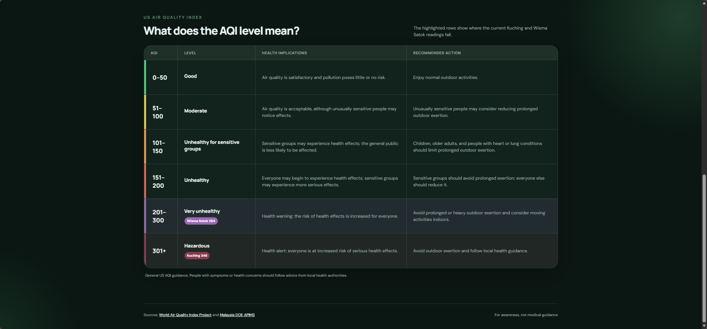

# Kuching Air Reader

A lightweight, open-source air-quality dashboard for Kuching, Sarawak. It places readings from multiple monitoring networks side by side so residents can quickly compare local conditions without moving between several provider websites.

**Live website:** [kuching-air-reader.wanfatt.workers.dev](https://kuching-air-reader.wanfatt.workers.dev/)


The interface includes a one-click refresh control, provider observation times, a matching browser-tab icon, and responsive cards that adapt from a three-column desktop comparison to a single-column phone layout.

## What this project does

Kuching Air Reader combines three perspectives:

| Reading | Source | Method |
| --- | --- | --- |
| Kuching | [AQICN city monitor](https://aqicn.org/city/malaysia/sarawak/kuching/) | Server-side extraction from the public city page |
| Wisma Satok | [AQICN AirNet sensor](https://aqicn.org/station/malaysia-kuching-wisma-satok/) | Token-free live AirNet feed with US EPA AQI conversion |
| Official Kuching API | [Malaysia DOE APIMS](https://eqms.doe.gov.my/APIMS/main) | Official hourly Malaysian Air Pollutant Index from the Kuching station |

The readings are deliberately shown separately rather than averaged. Sensor hardware, placement, correction formulas, and averaging windows differ, so combining them into one number would hide useful context.

## Features

- Live comparison of three Kuching-area readings
- Provider observation times in Malaysia time
- One-click refresh that bypasses the backend cache
- Live AQI health guide with highlighted Kuching and Wisma Satok bands
- Native light and dark themes
- Responsive desktop and mobile layouts
- Equal-height comparison cards on desktop
- Custom Kuching Air “K” favicon
- 60-second server cache to reduce provider traffic
- No private API token required
- Local Node.js server and Cloudflare Workers deployment
- Shared, tested US EPA PM2.5-to-AQI conversion

> This dashboard is for general awareness only. It is not medical advice or an official emergency-alert service.

## AQI health guide

Below the live readings, the site explains all six US AQI bands—from Good to Hazardous—with concise health implications and suggested actions. The current Kuching and Wisma Satok readings appear as live badges inside their corresponding rows, making the numbers easier to interpret at a glance.



The guide intentionally excludes advertising and promotional links from the provider pages. Its recommendations are general guidance; users should follow local health-authority advice when conditions are severe or symptoms occur.

## How it works

The browser requests `/api/kuching` from the local Node.js server or Cloudflare Worker. The backend retrieves two AQICN readings plus the official Kuching record from the Malaysia DOE APIMS public map service, normalizes their response shape, and returns JSON to the frontend.

```text
Browser
  ├─ /api/kuching ──> Node server or Cloudflare Worker
  │                     ├─ AQICN Kuching page
  │                     └─ AQICN AirNet feed (Wisma Satok)
  └─ /api/kuching ──> Malaysia DOE APIMS public map service
```

Wisma Satok's live PM2.5 concentration is converted to US AQI using the EPA breakpoints in `src/aqi.js`. Backend results are cached for 60 seconds.

## Run locally

Requirements: Node.js 18 or newer.

```bash
git clone <your-repository-url>
cd kuching-air-reader
npm install
npm start
```

Open [http://localhost:3000](http://localhost:3000).

Useful commands:

```bash
npm start                 # Run the Node.js server
npm run dev               # Restart the server when files change
npm test                  # Run the test suite
npm run cloudflare:dev    # Preview the Cloudflare Worker locally
```

## Deploy to Cloudflare Workers

Authenticate Wrangler, preview the Worker, and deploy:

```bash
npx wrangler login
npm run cloudflare:dev
npm run cloudflare:deploy
```

The Worker serves the files under `public/` and handles `/api/kuching` at the edge. Configuration is in `wrangler.jsonc`; change its `name` if the default Worker name is unavailable in your account.

## API response

`GET /api/kuching` returns a structure similar to:

```json
{
  "location": "Kuching, Sarawak, Malaysia",
  "sources": {
    "kuching": { "aqi": 284, "observedLabel": "Updated on Sunday 8:00" },
    "wismaSatok": { "aqi": 265, "pm25": 215.2, "observedAt": "2026-08-30T00:00:03.000Z" },
    "apimsKuching": { "aqi": 82, "standard": "Malaysia API", "stationId": "CA65Q" }
  },
  "fetchedAt": "2026-08-30T00:01:00.000Z",
  "cached": false
}
```

The header's **Refresh** button calls this endpoint with `?refresh=1`, bypassing the 60-second backend cache for immediate AQICN and APIMS updates. Avoid automating forced refreshes or using them for normal background traffic.

## Project structure

```text
docs/assets/      Dashboard and AQI-guide screenshots
public/           HTML, CSS, browser JavaScript, and favicon
src/aqi.js        Shared parsing and AQI calculation
test/             Parser and AQI tests
server.js         Local Node.js server
worker.js         Cloudflare Worker entry point
wrangler.jsonc    Cloudflare deployment configuration
```

## Data sources and limitations

Provider markup and public feeds can change without notice, which may temporarily break extraction. Values can also update at different times. Check the linked provider pages when a reading looks unusual.

Before running a public or commercial deployment, review the [World Air Quality Index Project usage notice](https://aqicn.org/contact/) and the [Malaysia DOE APIMS portal](https://eqms.doe.gov.my/APIMS/main). Cache responses and avoid excessive requests to upstream services.

## Contributing

Issues and pull requests are welcome. See [CONTRIBUTING.md](CONTRIBUTING.md) for development guidance and [SECURITY.md](SECURITY.md) for private vulnerability reporting.

Released under the [MIT License](LICENSE).
